<h1 align="center">


</h1>

  <h3 align="center">Find Tunes - Encontre as melodias que tocaram na sua vida 🎶</h3>
  <br>

  <p align="center">
    <a href="https://www.betrybe.com/">
      
    </a>
    <a href="https://www.linkedin.com/in/andersonleitedev/">
      
    </a>
  </p>

---

<p align="center">
  <a href="#dart-sobre">Sobre</a> &#xa0; | &#xa0; 
  <a href="#rocket-tecnologias">Tecnologias</a> &#xa0; | &#xa0;
  <a href="#white_check_mark-configurações-necessárias">Configurações necessárias</a> &#xa0; &#xa0; | &#xa0;
   <a href="#checkered_flag-começando">Começando</a> &#xa0; | &#xa0;
  <a href="#framed_picture-imagens">Imagens</a> &#xa0; &#xa0;
</p>

<br>

## :dart: Sobre ##

Esse foi um dos projetos que realizei na [Trybe](https://www.betrybe.com/), nele desenvolvi  o **Find Tunes**, uma aplicação capaz de reproduzir músicas das mais variadas bandas e artistas, criar uma lista de músicas favoritas e editar o perfil da pessoa usuária logada. Essa aplicação é capaz de:


- Fazer login;
- Pesquisar por uma banda ou artista;
- Listar os álbuns disponíveis dessa banda ou artista;
- Visualizar as músicas de um álbum selecionado;
- Reproduzir uma prévia das músicas deste álbum;
- Favoritar e desfavoritar músicas;
- Ver a lista de músicas favoritas;
- Ver o perfil da pessoa logada;
- Editar o perfil da pessoa logada;

## :rocket: Tecnologias ##

As seguintes tecnologias foram utilizadas no projeto:

- [Reactjs](https://reactjs.org/) | ^17.0.2
- [React Router](https://reactrouter.com/en/main) | ^6.3.0
- [Bootstrap](https://getbootstrap.com/) | ^5.2.1
- [React Bootstrap](https://react-bootstrap.github.io/) | ^2.5.0
- [Styled Components](https://styled-components.com/) | ^5.3.5
- [React icons](https://react-icons.github.io/react-icons/) | ^4.4.0
- [Prop-types](https://www.npmjs.com/package/prop-types) | ^15.7.2
- [Eslint](https://eslint.org/) | ^7.31.0
- [Stylelint](https://stylelint.io/) | ^13.8.0

<br/>

- [Apple Music API](https://developer.apple.com/documentation/applemusicapi/)

## :white_check_mark: Configurações necessárias ##

<p>Necessário realizar as instalações:</p>

- Ter [Git](https://git-scm.com/) para clonar o projeto.
- Ter [NodeJS](https://nodejs.org/en/) para rodar o projeto em ReactJS

## :checkered_flag: Começando ##

#### Execute o comando git clone para realizar o clone do repositório

```bash
git clone https://github.com/andersonleite1/Tunes
```

#### Entre na pasta do repositório clonado
```bash
cd Tunes
```

#### Execute `npm` para instalar as dependências
```bash
npm install
```

#### Para iniciar a aplicação
```bash
npm start
```

## :framed_picture: Imagens ##

### Desktop (screenshot):

| Tela de Login  | Tela de Pesquisa | 
| --- | --- |
| 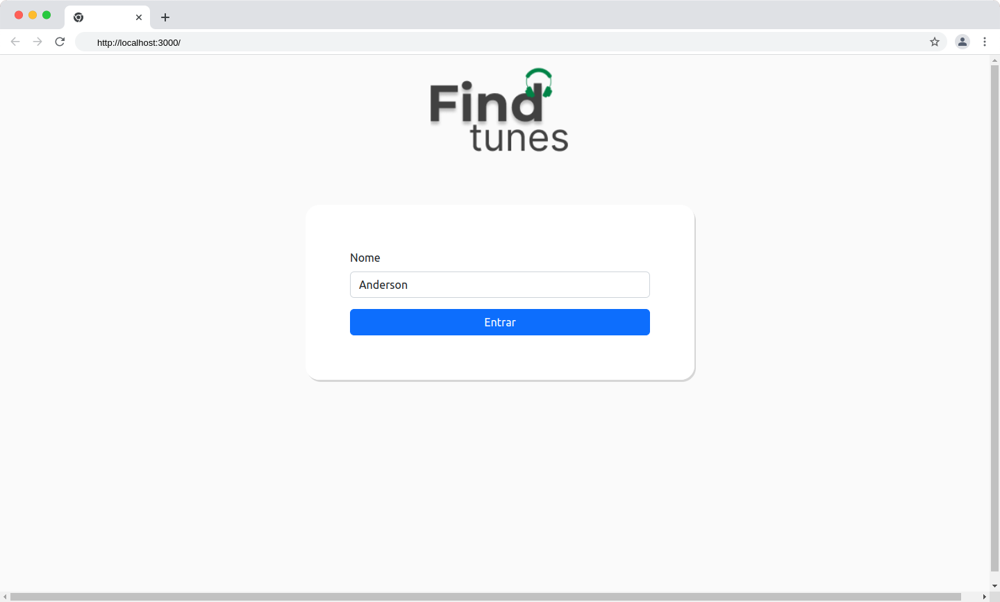 | 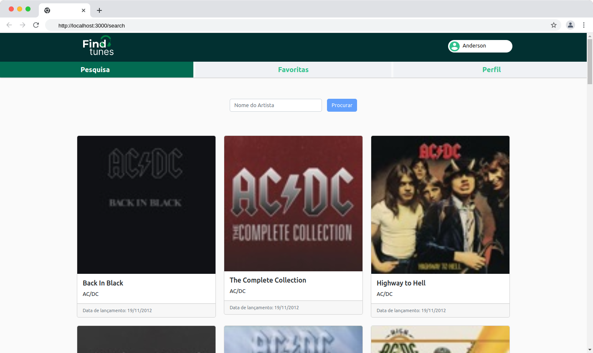 | 

| Tela de Album | Tela de Favoritos |
| --- | --- |
| 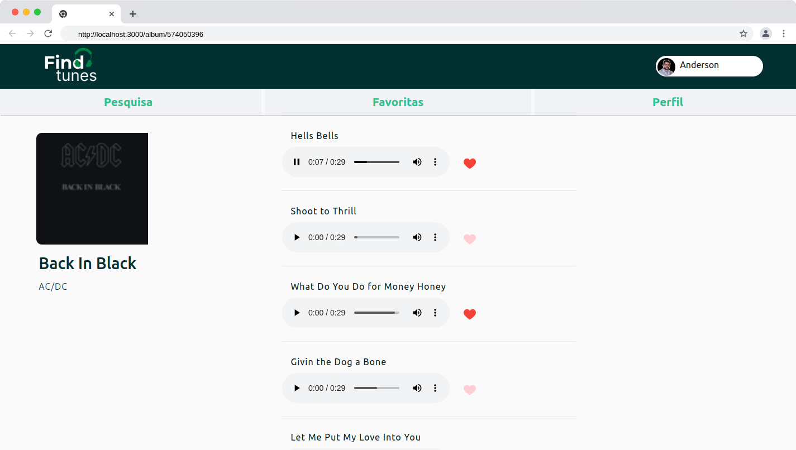 | 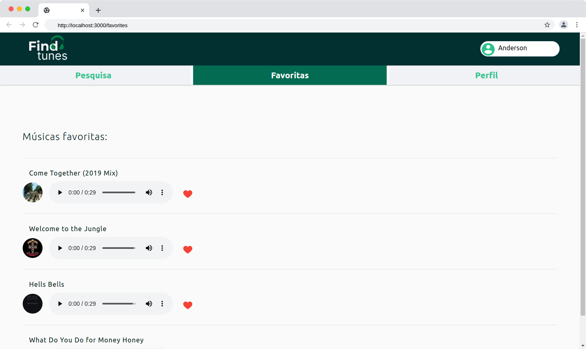 | 

| Tela de Perfil | Tela de Editar Perfil |
| --- | --- |
| 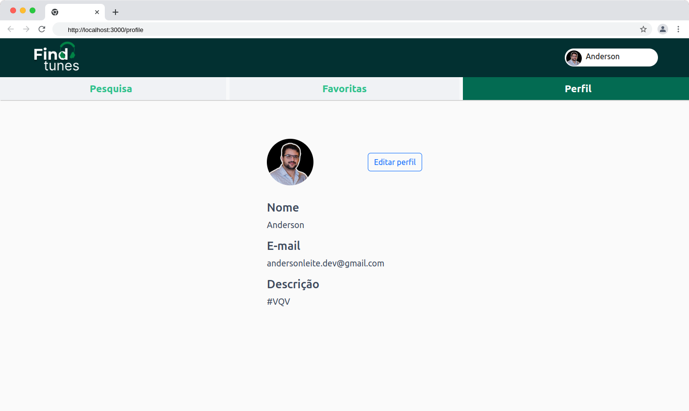 | 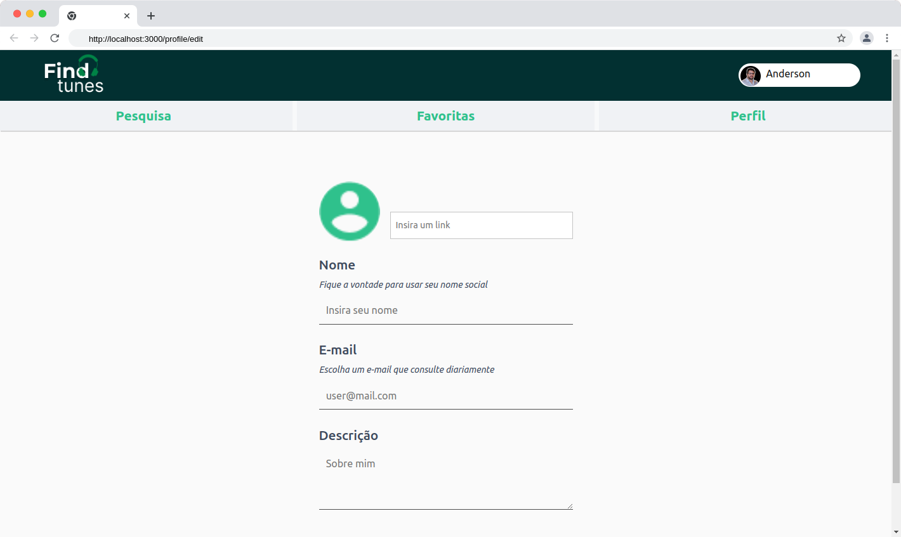 |

### Mobile (screenshot):

| Tela de Login | Tela de Pesquisa | Tela de Album | 
| --- | --- | --- |
| 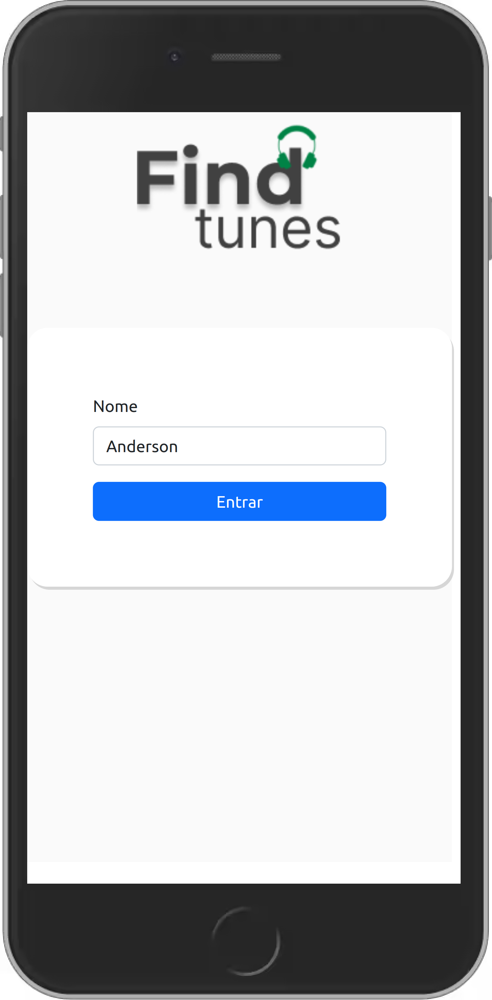 | 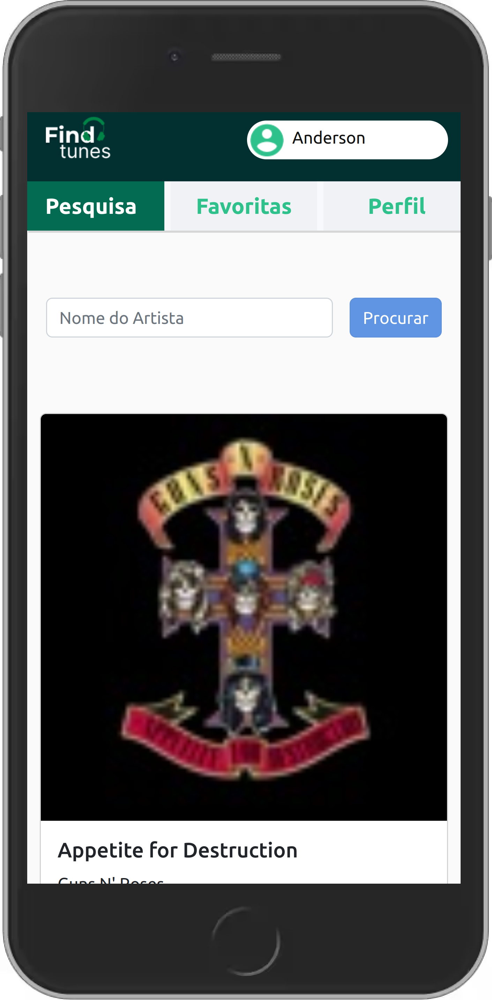 | 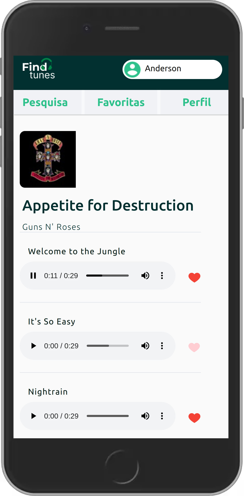 |

| Tela de Favoritos | Tela de Perfil | Tela de Editar Perfil | 
| --- | --- | --- |
| 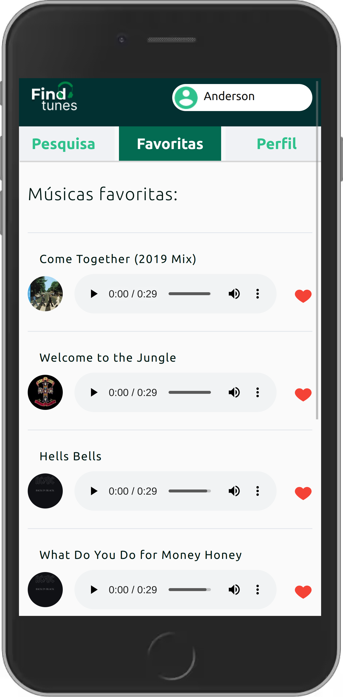 | 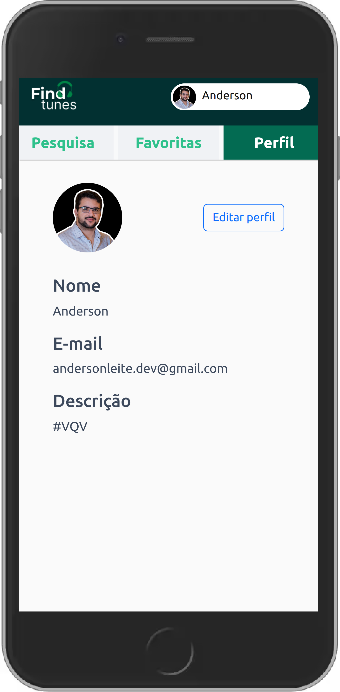 | 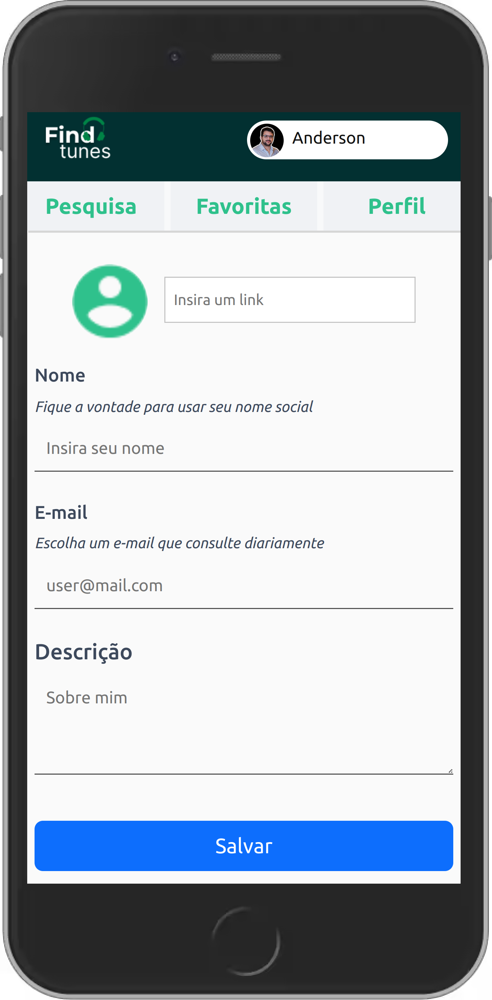 |


### Dê uma olhada como o projeto ficou! :eyes:

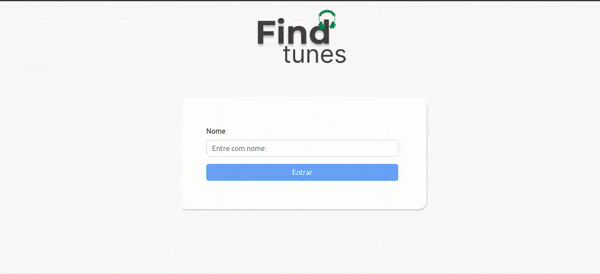

[find-tunes.vercel.app](https://find-tunes.vercel.app/)

<p align="right">
  <a href="https://www.linkedin.com/in/andersonleitedev/">
    
  </a>
</p>
